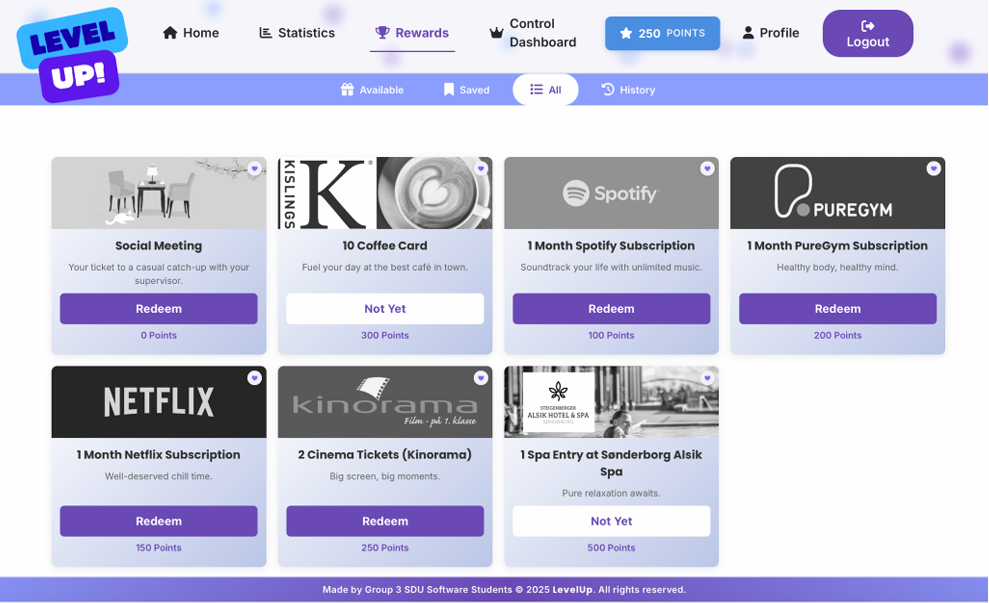

# LevelUp

LevelUp is a Group 3 web app that guides users through healthy sit–stand cycles using Cornell ergonomics research, awards points that can be redeemed for gift cards, and can optionally integrate hardware features like LED alerts and display text on an OLED display via a Raspberry Pi Pico W.

  

## Highlights

- Sit/stand scheduler with audible and visual cues
- Wifi2ble simulator that mimics a LINAK desk
- Daily point tracking with anti-gaming rules and feedback colors
- Optional Rasberry Pi Pico W board integration (OLED + RGB LED status display)

## 🚀 Getting Started

For full setup instructions including local PHP, Docker stack, simulator ports, and Pico W hardware flashing, please refer to the [SETUP.md](SETUP.md) guide.

### 🔑 Login Credentials

Once the application is running and seeded, you can log in with the following credentials:

| Role | Username | Password |
|------|----------|----------|
| **Admin** | `admin` | `LevelUp!Demo#2026` |
| **User** | `maxmust123` | `LevelUp!User#2026` |

## 🧪 Live Demo (Render)

We are currently hosting **both** the LevelUp app and the Wifi2Ble simulator.

Try the hosted demo here: https://levelup-app-div9.onrender.com/

**What you can do in the demo**
- Log in as admin or user
- View dashboards, rewards, stats, and profiles
- Use the admin control dashboard to create/edit users and manage desks
- Register and assign desks from the simulator
- Run sit/stand cycles using the simulator API

**What the demo does not include**
- Pico W hardware integration (OLED, RGB LED, pause button)

**Important demo notes**
- You can’t use the hosted demo and a Pico W at the same time (the demo can’t reach local hardware).
- Demo data resets periodically (ephemeral storage). This demo is for demonstration only.

**To use a Pico W**
Run the Laravel app locally or on a server in the same network as the Pico W, then set `WIFI2BLE_BASE_URL` to the Pico W’s URL. See [SETUP.md](SETUP.md) for the Pico W setup steps.

## Wifi2ble Simulator

The wifi2ble box simulator exposes the same API as a LINAK desk controller so you can test commands locally without moving a real desk. Run it when you want to validate commands, telemetry, and logging.

## Points At A Glance

- **Daily cap**: Earn up to 160 points per day
- **Minimum cycle**: 15 minutes total, shorter cycles earn 0 points
- **Scoring**: Weighted blend of ratio accuracy (70%, target 20 min sit : 10 min stand) and duration balance (30%, target ~30 min)

| Health Score | Points | Feedback |
| --- | --- | --- |
| 90–100 | +10 | 🟢 Perfect balance |
| 70–89 | +7 | 🟡 Great — minor tweaks optional |
| 50–69 | +4 | 🟠 Fair — adjust times |
| <50 or <15 min | 0 | 🔴 Too short or imbalanced |

  
  
Points can be redeemed for gift cards in this page

## Pico W Controls

  <h3>Pause button</h3>
  
   
  <h3>RGB LED transition indicator</h3>
  
   
  

- **OLED display** – Shows the active user greeting, total points, and real-time sit/stand alerts so you can demo LevelUp away from the browser.
- **RGB LED** – Glows purple while sitting, green while standing, and dims or pulses when the timer is paused.
- **Potentiometer** – Connected to the Pico’s ADC to modulate LED brightness; turn the knob to match the lighting of your workspace or make demos camera-friendly.
- **Pause button (GP10)** – Mirrors the in-app pause/resume toggle so you can control the timer from the hardware without touching the UI.

See [SETUP.md](SETUP.md) for flashing instructions via Thonny.

## 👥 Contributors

<table width="100%">
  <thead>
    <tr>
      <th>Name</th>
      <th>GitHub Profile</th>
    </tr>
  </thead>
  <tbody>
    <tr>
      <td><b>Luigi</b></td>
      <td><a href="https://github.com/Lucol24">Lucol24</a></td>
    </tr>
    <tr>
      <td><b>Carolina</b></td>
      <td><a href="https://github.com/chaeyrie">chaeyrie</a></td>
    </tr>
    <tr>
      <td><b>Gabriele</b></td>
      <td><a href="https://github.com/Gabbo693">Gabbo693</a></td>
    </tr>
    <tr>
      <td><b>Lara</b></td>
      <td>-</td>
    </tr>
    <tr>
      <td><b>Mats</b></td>
      <td><a href="https://github.com/mqts241">mqts241</a></td>
    </tr>
    <tr>
      <td><b>Manish</b></td>
      <td><a href="https://github.com/Manish-SDU">Manish-SDU</a></td>
    </tr>
  </tbody>
</table>
